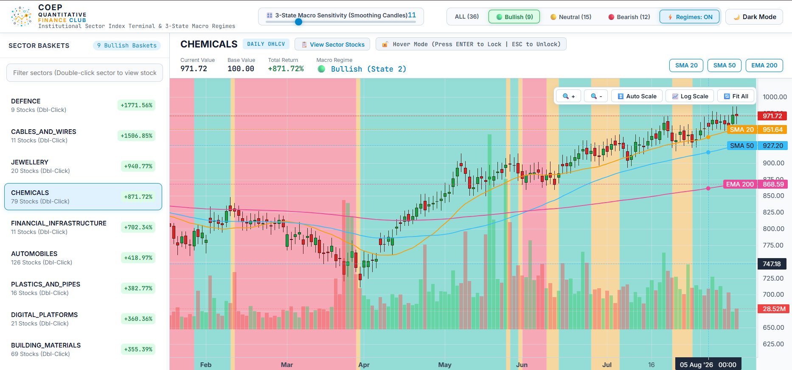
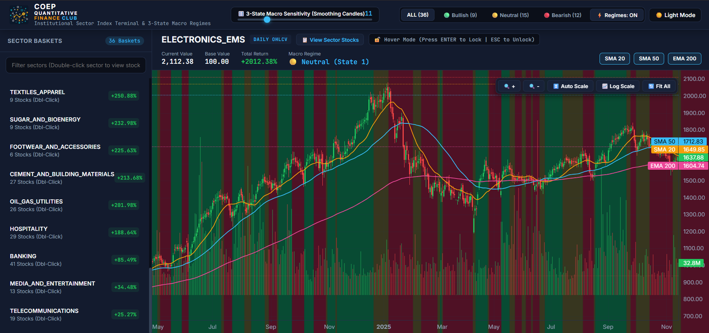

<div align="center">

<!-- ANIMATED SVG BANNER -->
<svg xmlns="http://www.w3.org/2000/svg" viewBox="0 0 900 150" width="100%">
  <defs>
    <linearGradient id="bg" x1="0%" y1="0%" x2="100%" y2="100%">
      <stop offset="0%" style="stop-color:#060d17"/>
      <stop offset="50%" style="stop-color:#0a192f"/>
      <stop offset="100%" style="stop-color:#060d17"/>
    </linearGradient>
    <linearGradient id="lineGrad" x1="0%" y1="0%" x2="100%" y2="0%">
      <stop offset="0%" style="stop-color:#06b6d4;stop-opacity:0"/>
      <stop offset="50%" style="stop-color:#06b6d4;stop-opacity:1"/>
      <stop offset="100%" style="stop-color:#10b981;stop-opacity:0"/>
    </linearGradient>
    <filter id="glow">
      <feGaussianBlur stdDeviation="3" result="coloredBlur"/>
      <feMerge><feMergeNode in="coloredBlur"/><feMergeNode in="SourceGraphic"/></feMerge>
    </filter>
    <filter id="glow2">
      <feGaussianBlur stdDeviation="5" result="coloredBlur"/>
      <feMerge><feMergeNode in="coloredBlur"/><feMergeNode in="SourceGraphic"/></feMerge>
    </filter>
  </defs>
  <rect width="900" height="150" fill="url(#bg)" rx="12"/>
  <rect width="900" height="150" fill="none" rx="12" stroke="#06b6d4" stroke-width="1" stroke-opacity="0.3"/>
  <line x1="0" y1="40" x2="900" y2="40" stroke="#ffffff" stroke-opacity="0.03" stroke-width="1"/>
  <line x1="0" y1="80" x2="900" y2="80" stroke="#ffffff" stroke-opacity="0.03" stroke-width="1"/>
  <line x1="0" y1="120" x2="900" y2="120" stroke="#ffffff" stroke-opacity="0.03" stroke-width="1"/>
  <!-- Candlesticks -->
  <rect x="590" y="75" width="12" height="35" fill="#f43f5e" rx="1" opacity="0.9" filter="url(#glow)"/>
  <line x1="596" y1="65" x2="596" y2="115" stroke="#f43f5e" stroke-width="1.5" opacity="0.7"/>
  <rect x="615" y="60" width="12" height="40" fill="#10b981" rx="1" opacity="0.9" filter="url(#glow)"/>
  <line x1="621" y1="50" x2="621" y2="105" stroke="#10b981" stroke-width="1.5" opacity="0.7"/>
  <rect x="640" y="70" width="12" height="30" fill="#f43f5e" rx="1" opacity="0.9" filter="url(#glow)"/>
  <line x1="646" y1="58" x2="646" y2="105" stroke="#f43f5e" stroke-width="1.5" opacity="0.7"/>
  <rect x="665" y="45" width="12" height="50" fill="#10b981" rx="1" opacity="0.9" filter="url(#glow)"/>
  <line x1="671" y1="32" x2="671" y2="100" stroke="#10b981" stroke-width="1.5" opacity="0.7"/>
  <rect x="690" y="35" width="12" height="55" fill="#10b981" rx="1" opacity="0.9" filter="url(#glow)"/>
  <line x1="696" y1="22" x2="696" y2="95" stroke="#10b981" stroke-width="1.5" opacity="0.7"/>
  <rect x="715" y="48" width="12" height="40" fill="#f43f5e" rx="1" opacity="0.9" filter="url(#glow)"/>
  <line x1="721" y1="35" x2="721" y2="95" stroke="#f43f5e" stroke-width="1.5" opacity="0.7"/>
  <rect x="740" y="28" width="12" height="60" fill="#10b981" rx="1" opacity="0.9" filter="url(#glow)"/>
  <line x1="746" y1="15" x2="746" y2="95" stroke="#10b981" stroke-width="1.5" opacity="0.7"/>
  <rect x="765" y="18" width="12" height="65" fill="#10b981" rx="1" opacity="0.9" filter="url(#glow)"/>
  <line x1="771" y1="5" x2="771" y2="90" stroke="#10b981" stroke-width="1.5" opacity="0.7"/>
  <rect x="790" y="30" width="12" height="50" fill="#f43f5e" rx="1" opacity="0.9" filter="url(#glow)"/>
  <line x1="796" y1="18" x2="796" y2="88" stroke="#f43f5e" stroke-width="1.5" opacity="0.7"/>
  <rect x="815" y="12" width="12" height="70" fill="#10b981" rx="1" opacity="0.9" filter="url(#glow)"/>
  <line x1="821" y1="2" x2="821" y2="88" stroke="#10b981" stroke-width="1.5" opacity="0.7"/>
  <!-- Moving average -->
  <polyline points="590,90 615,80 640,80 665,65 690,55 715,62 740,48 765,40 790,48 821,35"
    fill="none" stroke="#06b6d4" stroke-width="2" stroke-opacity="0.8" filter="url(#glow)" stroke-dasharray="4,2"/>
  <text x="50" y="48" font-family="monospace" font-size="11" fill="#06b6d4" opacity="0.8" letter-spacing="4">COEP QUANT FINANCE CLUB</text>
  <text x="48" y="90" font-family="monospace" font-weight="bold" font-size="32" fill="#ffffff" filter="url(#glow2)" letter-spacing="2">36-SECTOR MARKET INDEX</text>
  <text x="50" y="118" font-family="monospace" font-size="13" fill="#94a3b8" letter-spacing="1">Institutional-Grade Sector Intelligence · 1,451 Stocks · 36 Master Sectors</text>
</svg>

<br/>

[](https://python.org)
[](https://coep-quant-finance-club.github.io/club-website/market-index)
[](https://coep-quant-finance-club.github.io/club-website/resources)
[](#-36-master-sector-universe)
[](#-index-methodology)

<br/>

> **India's First Student-Built Institutional Sector Index Architecture**  
> A production-grade, zero-forward-bias quantitative equity platform tracking **36 specialized master sectors**, **3-state macro regimes**, and **intraday liquidity spillovers** across **1,451 Indian equities** (2015 – 2026).

[🌐 **Explore Live Terminal**](https://coep-quant-finance-club.github.io/club-website/market-index) • [📦 **Download Datasets (ZIP/CSV)**](https://coep-quant-finance-club.github.io/club-website/resources) • [📑 **Sector Universe**](#-36-master-sector-universe)

</div>

---

## 🖥️ Institutional Terminal Previews

<div align="center">

### 1. Master Terminal Dashboard & Live Sector Waveforms
*Interactive 36-sector momentum tracker, real-time regime signals, and 30-day normalized price curves.*



<br/><br/>

### 2. Multi-Sector Macro Regime Matrix & Constituents
*3-State Markov regime classification (Bullish, Accumulation, Bearish), constituent weights, and volatility risk parity scoring.*



</div>

---

## 📊 Master 36-Sector Benchmark Leaderboard

> **Base Value**: `100.00` (Jan 1, 2015) • **Audited Horizon**: 11.66 Years (2,878 Daily Trading Bars) • **Coverage**: 1,451 Stocks

<!-- SECTOR_LEADERBOARD_START -->
| Rank | Master Sector Basket | Index Level | Total Return | 11.66-Yr CAGR | Ann. Volatility | Max Drawdown | Sharpe Ratio |
|:---:|:---|:---:|:---:|:---:|:---:|:---:|:---:|
| 🥇  | **Electronics EMS** | `2,112.38` | **+2,012.4%** | `30.03%` | `32.46%` | `-66.8%` | **`0.79`** |
| 🥈  | **Defence** | `1,871.56` | **+1,771.6%** | `28.68%` | `31.07%` | `-66.6%` | **`0.77`** |
| 🥉  | **Cables And Wires** | `1,606.85` | **+1,506.8%** | `27.00%` | `29.04%` | `-54.0%` | **`0.76`** |
| 4 | **Retail** | `1,067.11` | **+967.1%** | `22.61%` | `25.97%` | `-45.5%` | **`0.68`** |
| 5 | **Jewellery** | `1,040.77` | **+940.8%** | `22.34%` | `24.99%` | `-46.2%` | **`0.69`** |
| 6 | **Chemicals** | `971.72` | **+871.7%** | `21.62%` | `19.08%` | `-31.0%` | **`0.80`** |
| 7 | **Financial Infrastructure** | `802.34` | **+702.3%** | `19.63%` | `22.37%` | `-49.8%` | **`0.64`** |
| 8 | **Paper And Packaging** | `754.05` | **+654.1%** | `19.00%` | `24.85%` | `-54.3%` | **`0.58`** |
| 9 | **Power And Utilities** | `671.94` | **+571.9%** | `17.82%` | `23.39%` | `-53.8%` | **`0.56`** |
| 10 | **Infrastructure** | `668.09` | **+568.1%** | `17.76%` | `31.95%` | `-64.3%` | **`0.48`** |
| 11 | **Metals And Mining** | `640.68` | **+540.7%** | `17.34%` | `23.60%` | `-59.8%` | **`0.54`** |
| 12 | **Real Estate** | `620.18` | **+520.2%** | `17.01%` | `28.62%` | `-55.6%` | **`0.48`** |
| 13 | **Capital Goods** | `611.14` | **+511.1%** | `16.86%` | `21.01%` | `-43.0%` | **`0.55`** |
| 14 | **Logistics** | `563.91` | **+463.9%** | `16.06%` | `26.05%` | `-46.9%` | **`0.46`** |
| 15 | **Financial Services** | `533.57` | **+433.6%** | `15.50%` | `21.76%` | `-48.2%` | **`0.49`** |
| 16 | **Automobiles** | `518.97` | **+419.0%** | `15.23%` | `17.25%` | `-37.2%` | **`0.55`** |
| 17 | **Plastics And Pipes** | `482.77` | **+382.8%** | `14.51%` | `22.67%` | `-53.4%` | **`0.44`** |
| 18 | **Digital Platforms** | `460.36` | **+360.4%** | `14.05%` | `31.30%` | `-53.5%` | **`0.38`** |
| 19 | **Building Materials** | `455.39` | **+355.4%** | `13.94%` | `20.21%` | `-67.1%` | **`0.44`** |
| 20 | **Fertilizers And Agrochemicals** | `453.69` | **+353.7%** | `13.90%` | `19.28%` | `-35.8%` | **`0.45`** |
| 21 | **Information Technology** | `417.44` | **+317.4%** | `13.09%` | `20.64%` | `-32.8%` | **`0.40`** |
| 22 | **Renewable Energy** | `414.72` | **+314.7%** | `13.03%` | `43.43%` | `-88.3%` | **`0.35`** |
| 23 | **Paints And Varnishes** | `372.63` | **+272.6%** | `11.99%` | `22.05%` | `-38.1%` | **`0.34`** |
| 24 | **Healthcare Services** | `371.18` | **+271.2%** | `11.95%` | `16.87%` | `-35.2%` | **`0.38`** |
| 25 | **Consumer Durables** | `366.54` | **+266.5%** | `11.83%` | `19.11%` | `-41.5%` | **`0.35`** |
| 26 | **Breweries And Distilleries** | `362.21` | **+262.2%** | `11.72%` | `24.78%` | `-46.1%` | **`0.32`** |
| 27 | **Consumer Staples** | `356.68` | **+256.7%** | `11.57%` | `16.81%` | `-33.1%` | **`0.36`** |
| 28 | **Textiles Apparel** | `350.88` | **+250.9%** | `11.41%` | `24.34%` | `-57.2%` | **`0.31`** |
| 29 | **Sugar And Bioenergy** | `332.98` | **+233.0%** | `10.91%` | `33.98%` | `-72.9%` | **`0.29`** |
| 30 | **Footwear And Accessories** | `325.63` | **+225.6%** | `10.70%` | `22.28%` | `-46.4%` | **`0.29`** |
| 31 | **Cement And Building Materials** | `313.68` | **+213.7%** | `10.34%` | `22.09%` | `-37.8%` | **`0.27`** |
| 32 | **Oil Gas Utilities** | `301.98` | **+202.0%** | `9.98%` | `24.71%` | `-56.8%` | **`0.25`** |
| 33 | **Hospitality** | `288.64` | **+188.6%** | `9.55%` | `22.78%` | `-55.7%` | **`0.24`** |
| 34 | **Banking** | `185.49` | **+85.5%** | `5.46%` | `22.42%` | `-58.9%` | **`0.07`** |
| 35 | **Media And Entertainment** | `134.48` | **+34.5%** | `2.58%` | `26.54%` | `-71.5%` | **`-0.01`** |
| 36 | **Telecommunications** | `125.27` | **+25.3%** | `1.96%` | `29.71%` | `-80.4%` | **`-0.00`** |
<!-- SECTOR_LEADERBOARD_END -->

---

## 📥 1-Click Open Access Quantitative Datasets

All datasets are split-adjusted, audited for continuity, and available for researchers and algorithmic traders with a single click:

| Package | Format | File Size | Description | Download Link |
|:---|:---:|:---:|:---|:---:|
| **Consolidated Master Daily CSV** | `CSV` | **7.84 MB** | All 36 sector time series unified into 1 master table (103,608 trading bars) | [📥 Download CSV](https://coep-quant-finance-club.github.io/club-website/downloads/coep_36_sector_indices_daily_master.csv) |
| **36-Sector Daily OHLCV Bundle** | `ZIP` | **2.28 MB** | 36 dedicated CSV files + statistical performance manifest | [📦 Download ZIP](https://coep-quant-finance-club.github.io/club-website/downloads/coep_36_sector_indices_daily_csv.zip) |
| **36-Sector 1-Hour Intraday Bundle** | `ZIP` | **2.27 MB** | 36 high-frequency 1-hour candlestick OHLCV files | [⏱️ Download ZIP](https://coep-quant-finance-club.github.io/club-website/downloads/coep_36_sector_indices_1hour_csv.zip) |
| **Performance & Risk Summary** | `CSV` | **6.6 KB** | Audited CAGR, Volatility, Sharpe, and Drawdown matrix | [📑 Download Summary](https://coep-quant-finance-club.github.io/club-website/downloads/coep_36_sector_indices_metrics_summary.csv) |

#### 🐍 Direct Python / Pandas Integration
```python
import pandas as pd

# Stream master daily index series directly into pandas DataFrame
url = "https://coep-quant-finance-club.github.io/club-website/downloads/coep_36_sector_indices_daily_master.csv"
df = pd.read_csv(url)

print(f"Loaded {len(df):,} bars across {df['Sector_Code'].nunique()} sectors.")
```

---

## 🏗️ Quantitative Architecture Pipeline


---

## 🔬 Index Methodology

> **Zero-forward-bias free-float market-capitalization weighting:**
> * Share counts $Q_i$ are fixed at the base date ($Q_i = rac{	ext{Base Market Cap}_0 	imes 10^7}{	ext{Base Price}_0}$) to ensure the index price action reflects pure equity price movement rather than secondary dilution.
> * Weights $w_{i,t-1}$ are lagged to market close $t-1$, eliminating lookahead bias.
> * Cumulative index levels are chained daily ($I_t = I_{t-1} 	imes (1 + R_{s,t})$) with $I_0 = 100.00$ starting on Jan 1, 2015.

---

## 🗺️ 36 Master Sector Universe

Every Indian equity in the 1,451-stock universe belongs to **exactly one clean sector basket**:

| Sector Cluster Profile | Constituent Sector Baskets |
|:---|:---|
| 🏦 **Financials & Banking** | `BANKING` (41) • `FINANCIAL_SERVICES` (134) • `FINANCIAL_INFRASTRUCTURE` (10) |
| ⚙️ **Industrials & Heavy Infra** | `CAPITAL_GOODS` (139) • `INFRASTRUCTURE` (39) • `POWER_AND_UTILITIES` (27) • `RENEWABLE_ENERGY` (15) • `OIL_GAS_UTILITIES` (26) • `LOGISTICS` (29) • `REAL_ESTATE` (47) • `METALS_AND_MINING` (111) |
| 🔬 **Technology & High Alpha** | `ELECTRONICS_EMS` (22) • `DEFENCE` (9) • `CABLES_AND_WIRES` (11) • `INFORMATION_TECHNOLOGY` (87) • `DIGITAL_PLATFORMS` (23) • `TELECOMMUNICATIONS` (18) |
| 🧪 **Chemicals & Commodities** | `CHEMICALS` (78) • `FERTILIZERS_AND_AGROCHEMICALS` (39) • `PLASTICS_AND_PIPES` (15) • `PAPER_AND_PACKAGING` (19) • `BUILDING_MATERIALS` (26) • `CEMENT_AND_BUILDING_MATERIALS` (22) • `PAINTS_AND_VARNISHES` (6) |
| 🛍️ **Consumption, Retail & Healthcare**| `RETAIL` (20) • `JEWELLERY` (21) • `AUTOMOBILES` (128) • `CONSUMER_DURABLES` (23) • `CONSUMER_STAPLES` (36) • `HEALTHCARE_SERVICES` (107) • `TEXTILES_APPAREL` (50) • `FOOTWEAR_AND_ACCESSORIES` (6) • `HOSPITALITY` (29) • `BREWERIES_AND_DISTILLERIES` (13) • `SUGAR_AND_BIOENERGY` (12) • `MEDIA_AND_ENTERTAINMENT` (13) |

---

<div align="center">

[](https://github.com/COEP-Quant-Finance-Club)
[](https://coep-quant-finance-club.github.io/club-website/)

</div>
