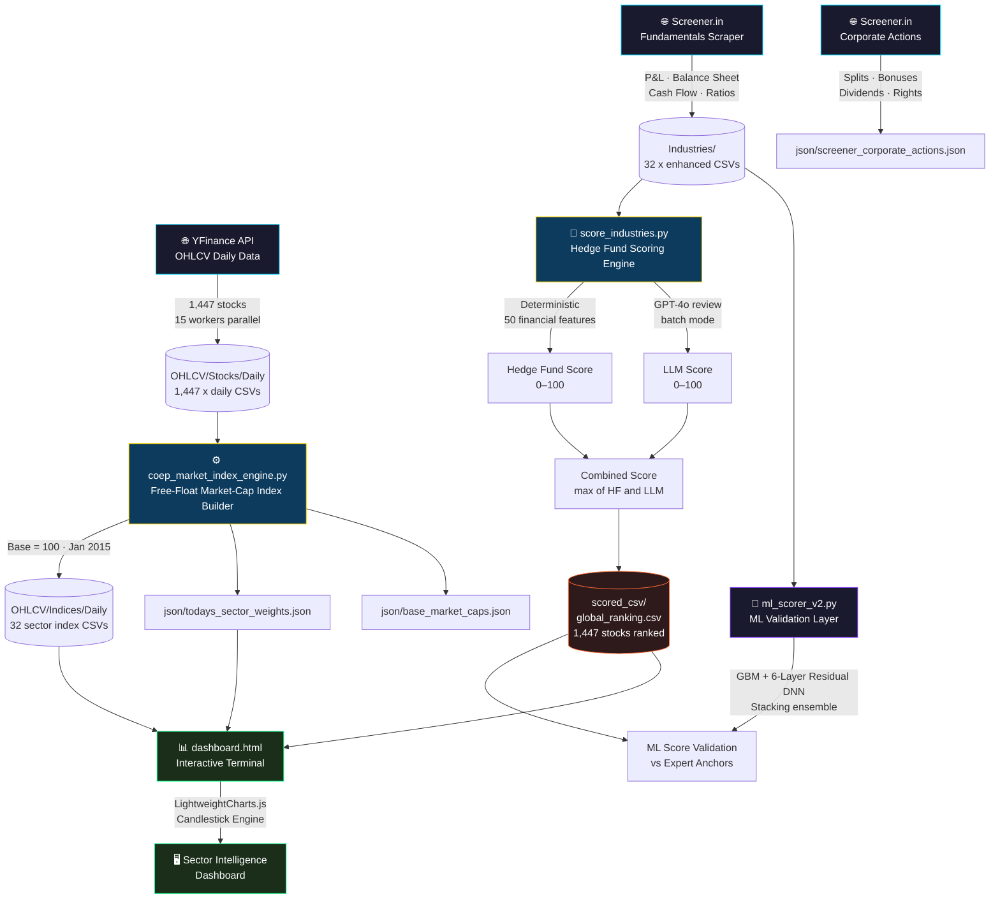

<div align="center">

<!-- ANIMATED SVG BANNER -->
<svg xmlns="http://www.w3.org/2000/svg" viewBox="0 0 900 150" width="100%">
  <defs>
    <linearGradient id="bg" x1="0%" y1="0%" x2="100%" y2="100%">
      <stop offset="0%" style="stop-color:#0a0a1a"/>
      <stop offset="50%" style="stop-color:#0d1b3e"/>
      <stop offset="100%" style="stop-color:#0a0a1a"/>
    </linearGradient>
    <linearGradient id="lineGrad" x1="0%" y1="0%" x2="100%" y2="0%">
      <stop offset="0%" style="stop-color:#00d4ff;stop-opacity:0"/>
      <stop offset="50%" style="stop-color:#00d4ff;stop-opacity:1"/>
      <stop offset="100%" style="stop-color:#7b2ff7;stop-opacity:0"/>
    </linearGradient>
    <filter id="glow">
      <feGaussianBlur stdDeviation="3" result="coloredBlur"/>
      <feMerge><feMergeNode in="coloredBlur"/><feMergeNode in="SourceGraphic"/></feMerge>
    </filter>
    <filter id="glow2">
      <feGaussianBlur stdDeviation="5" result="coloredBlur"/>
      <feMerge><feMergeNode in="coloredBlur"/><feMergeNode in="SourceGraphic"/></feMerge>
    </filter>
  </defs>
  <rect width="900" height="150" fill="url(#bg)" rx="12"/>
  <rect width="900" height="150" fill="none" rx="12" stroke="#00d4ff" stroke-width="1" stroke-opacity="0.3"/>
  <line x1="0" y1="40" x2="900" y2="40" stroke="#ffffff" stroke-opacity="0.03" stroke-width="1"/>
  <line x1="0" y1="80" x2="900" y2="80" stroke="#ffffff" stroke-opacity="0.03" stroke-width="1"/>
  <line x1="0" y1="120" x2="900" y2="120" stroke="#ffffff" stroke-opacity="0.03" stroke-width="1"/>
  <!-- Candlesticks -->
  <rect x="590" y="75" width="12" height="35" fill="#ff4466" rx="1" opacity="0.9" filter="url(#glow)"/>
  <line x1="596" y1="65" x2="596" y2="115" stroke="#ff4466" stroke-width="1.5" opacity="0.7"/>
  <rect x="615" y="60" width="12" height="40" fill="#00ff88" rx="1" opacity="0.9" filter="url(#glow)"/>
  <line x1="621" y1="50" x2="621" y2="105" stroke="#00ff88" stroke-width="1.5" opacity="0.7"/>
  <rect x="640" y="70" width="12" height="30" fill="#ff4466" rx="1" opacity="0.9" filter="url(#glow)"/>
  <line x1="646" y1="58" x2="646" y2="105" stroke="#ff4466" stroke-width="1.5" opacity="0.7"/>
  <rect x="665" y="45" width="12" height="50" fill="#00ff88" rx="1" opacity="0.9" filter="url(#glow)"/>
  <line x1="671" y1="32" x2="671" y2="100" stroke="#00ff88" stroke-width="1.5" opacity="0.7"/>
  <rect x="690" y="35" width="12" height="55" fill="#00ff88" rx="1" opacity="0.9" filter="url(#glow)"/>
  <line x1="696" y1="22" x2="696" y2="95" stroke="#00ff88" stroke-width="1.5" opacity="0.7"/>
  <rect x="715" y="48" width="12" height="40" fill="#ff4466" rx="1" opacity="0.9" filter="url(#glow)"/>
  <line x1="721" y1="35" x2="721" y2="95" stroke="#ff4466" stroke-width="1.5" opacity="0.7"/>
  <rect x="740" y="28" width="12" height="60" fill="#00ff88" rx="1" opacity="0.9" filter="url(#glow)"/>
  <line x1="746" y1="15" x2="746" y2="95" stroke="#00ff88" stroke-width="1.5" opacity="0.7"/>
  <rect x="765" y="18" width="12" height="65" fill="#00ff88" rx="1" opacity="0.9" filter="url(#glow)"/>
  <line x1="771" y1="5" x2="771" y2="90" stroke="#00ff88" stroke-width="1.5" opacity="0.7"/>
  <rect x="790" y="30" width="12" height="50" fill="#ff4466" rx="1" opacity="0.9" filter="url(#glow)"/>
  <line x1="796" y1="18" x2="796" y2="88" stroke="#ff4466" stroke-width="1.5" opacity="0.7"/>
  <rect x="815" y="12" width="12" height="70" fill="#00ff88" rx="1" opacity="0.9" filter="url(#glow)"/>
  <line x1="821" y1="2" x2="821" y2="88" stroke="#00ff88" stroke-width="1.5" opacity="0.7"/>
  <!-- Moving average -->
  <polyline points="590,90 615,80 640,80 665,65 690,55 715,62 740,48 765,40 790,48 821,35"
    fill="none" stroke="#ffd700" stroke-width="2" stroke-opacity="0.8" filter="url(#glow)" stroke-dasharray="4,2"/>
  <text x="50" y="48" font-family="monospace" font-size="11" fill="#00d4ff" opacity="0.7" letter-spacing="4">COEP QUANT FINANCE CLUB</text>
  <text x="48" y="90" font-family="monospace" font-weight="bold" font-size="32" fill="#ffffff" filter="url(#glow2)" letter-spacing="2">MARKET INDEX ENGINE</text>
  <text x="50" y="118" font-family="monospace" font-size="13" fill="#7b8ab8" letter-spacing="1">Institutional-Grade Sector Intelligence · 1,447 Stocks · 32 Sectors</text>
</svg>

<br/>

[](https://python.org)
[](https://github.com/ranaroussi/yfinance)
[](https://screener.in)
[](https://pandas.pydata.org)
[](https://scikit-learn.org)
[](https://github.com/COEP-Quant-Finance-Club/COEP_Market_index)

<br/>

> **A production-grade, zero-forward-bias Indian equity intelligence platform** — combining free-float sector indices, institutional hedge fund scoring, LLM-augmented fundamental analysis, and ML model validation across **1,447 stocks** in **32 master sectors**.

</div>

---

## 📊 Live Sector Leaderboard

> All indices base-100 from **Jan 2015**. Rebuilt daily via YFinance.

| Rank | Sector | Index Level | Total Return | Constituents |
|:---:|:---|:---:|:---:|:---:|
| 🥇 1 | Electronics EMS | 2,139.7 | +2,039.7% | 21 |
| 🥈 2 | Defence | 1,820.8 | +1,720.8% | 9 |
| 🥉 3 | Cables And Wires | 1,551.6 | +1,451.6% | 11 |
| 4 | Retail | 1,054.1 | +954.1% | 18 |
| 5 | Jewellery | 1,047.8 | +947.9% | 20 |
| 6 | Chemicals | 825.8 | +725.8% | 79 |
| 7 | Financial Infrastructure | 800.4 | +700.4% | 11 |
| 8 | Paper And Packaging | 759.7 | +659.7% | 20 |
| 9 | Infrastructure | 669.6 | +569.6% | 38 |
| 10 | Power And Utilities | 668.8 | +568.8% | 28 |
| 11 | Metals And Mining | 647.8 | +547.8% | 110 |
| 12 | Capital Goods | 604.9 | +504.9% | 139 |
| 13 | Real Estate | 567.5 | +467.5% | 47 |
| 14 | Financial Services | 515.2 | +415.2% | 131 |
| 15 | Plastics And Pipes | 484.5 | +384.5% | 16 |
| 16 | Logistics | 474.3 | +374.3% | 30 |
| 17 | Fertilizers And Agrochemicals | 453.8 | +353.8% | 38 |
| 18 | Building Materials | 453.7 | +353.7% | 69 |
| 19 | Automobiles | 445.0 | +345.0% | 126 |
| 20 | Renewable Energy | 422.4 | +322.4% | 15 |
| 21 | Information Technology | 392.8 | +292.8% | 85 |
| 22 | Digital Platforms | 385.0 | +285.0% | 21 |
| 23 | Paints And Varnishes | 371.6 | +271.6% | 6 |
| 24 | Healthcare Services | 370.9 | +270.9% | 107 |
| 25 | Textiles Apparel | 368.7 | +268.7% | 9 |
| 26 | Breweries And Distilleries | 362.8 | +262.8% | 13 |
| 27 | Consumer Durables | 359.0 | +259.0% | 23 |
| 28 | Consumer Staples | 350.8 | +250.8% | 37 |
| 29 | Sugar And Bioenergy | 344.6 | +244.7% | 9 |
| 30 | Footwear And Accessories | 323.6 | +223.6% | 6 |
| 31 | Cement And Building Materials | 312.6 | +212.6% | 27 |
| 32 | Oil Gas Utilities | 287.2 | +187.2% | 26 |
| 33 | Hospitality | 286.1 | +186.1% | 29 |
| 34 | Banking | 185.7 | +85.7% | 41 |
| 35 | Media And Entertainment | 136.8 | +36.8% | 13 |
| 36 | Telecommunications | 122.0 | +22.1% | 19 |

---:|:---|:---:|:---:|:---:|
| 🥇 1 | Electronics EMS | 2,163.3 | +2,063.3% | 21 |
| 🥈 2 | Defence | 1,822.5 | +1,722.5% | 9 |
| 🥉 3 | Cables And Wires | 1,565.1 | +1,465.1% | 11 |
| 4 | Retail | 1,061.6 | +961.6% | 18 |
| 5 | Jewellery | 1,037.0 | +937.0% | 20 |
| 6 | Chemicals | 829.6 | +729.6% | 79 |
| 7 | Financial Infrastructure | 801.8 | +701.8% | 11 |
| 8 | Paper And Packaging | 739.6 | +639.6% | 20 |
| 9 | Power And Utilities | 671.7 | +571.7% | 28 |
| 10 | Infrastructure | 663.6 | +563.6% | 38 |
| 11 | Metals And Mining | 642.6 | +542.6% | 110 |
| 12 | Capital Goods | 608.9 | +508.9% | 139 |
| 13 | Real Estate | 565.5 | +465.5% | 47 |
| 14 | Financial Services | 520.1 | +420.1% | 131 |
| 15 | Plastics And Pipes | 481.6 | +381.6% | 16 |
| 16 | Logistics | 477.2 | +377.2% | 30 |
| 17 | Building Materials | 456.6 | +356.6% | 69 |
| 18 | Fertilizers And Agrochemicals | 452.4 | +352.4% | 38 |
| 19 | Automobiles | 445.5 | +345.5% | 126 |
| 20 | Renewable Energy | 423.0 | +323.0% | 15 |
| 21 | Information Technology | 399.8 | +299.8% | 85 |
| 22 | Digital Platforms | 386.0 | +286.0% | 21 |
| 23 | Healthcare Services | 377.3 | +277.3% | 107 |
| 24 | Paints And Varnishes | 372.9 | +272.9% | 6 |
| 25 | Consumer Durables | 364.4 | +264.4% | 23 |
| 26 | Breweries And Distilleries | 362.5 | +262.5% | 13 |
| 27 | Textiles Apparel | 361.4 | +261.4% | 9 |
| 28 | Consumer Staples | 355.4 | +255.4% | 37 |
| 29 | Sugar And Bioenergy | 333.9 | +233.9% | 9 |
| 30 | Footwear And Accessories | 326.4 | +226.4% | 6 |
| 31 | Cement And Building Materials | 314.1 | +214.1% | 27 |
| 32 | Oil Gas Utilities | 285.5 | +185.5% | 26 |
| 33 | Hospitality | 285.4 | +185.3% | 29 |
| 34 | Banking | 185.3 | +85.3% | 41 |
| 35 | Media And Entertainment | 135.4 | +35.4% | 13 |
| 36 | Telecommunications | 125.0 | +25.0% | 19 |

---:|:---|:---:|:---:|:---:|

---:|:---|:---:|:---:|:---:|
| 🥇 1 | Electronics EMS | 2,160.5 | +2,060.5% | 21 |
| 🥈 2 | Defence | 1,861.7 | +1,761.7% | 9 |
| 🥉 3 | Cables And Wires | 1,616.7 | +1,516.7% | 11 |
| 4 | Retail | 1,076.5 | +976.5% | 18 |
| 5 | Jewellery | 1,038.4 | +938.4% | 20 |
| 6 | Chemicals | 971.9 | +871.9% | 79 |
| 7 | Financial Infrastructure | 804.4 | +704.4% | 11 |
| 8 | Paper And Packaging | 752.5 | +652.5% | 20 |
| 9 | Power And Utilities | 676.0 | +576.0% | 28 |
| 10 | Infrastructure | 669.9 | +569.9% | 38 |
| 11 | Metals And Mining | 646.4 | +546.4% | 110 |
| 12 | Real Estate | 623.3 | +523.3% | 47 |
| 13 | Capital Goods | 612.6 | +512.6% | 139 |
| 14 | Logistics | 562.6 | +462.6% | 30 |
| 15 | Financial Services | 541.6 | +441.6% | 131 |
| 16 | Automobiles | 520.3 | +420.3% | 126 |
| 17 | Plastics And Pipes | 486.4 | +386.4% | 16 |
| 18 | Digital Platforms | 463.0 | +363.0% | 21 |
| 19 | Building Materials | 458.0 | +358.0% | 69 |
| 20 | Fertilizers And Agrochemicals | 452.5 | +352.5% | 38 |
| 21 | Renewable Energy | 422.0 | +322.0% | 15 |
| 22 | Information Technology | 418.9 | +318.9% | 85 |
| 23 | Paints And Varnishes | 378.2 | +278.2% | 6 |
| 24 | Healthcare Services | 376.6 | +276.6% | 107 |
| 25 | Breweries And Distilleries | 361.6 | +261.6% | 13 |
| 26 | Consumer Staples | 357.4 | +257.4% | 37 |
| 27 | Consumer Durables | 354.9 | +254.9% | 23 |
| 28 | Textiles Apparel | 350.5 | +250.5% | 9 |
| 29 | Sugar And Bioenergy | 335.8 | +235.8% | 9 |
| 30 | Footwear And Accessories | 323.4 | +223.4% | 6 |
| 31 | Cement And Building Materials | 315.1 | +215.1% | 27 |
| 32 | Oil Gas Utilities | 302.6 | +202.6% | 26 |
| 33 | Hospitality | 287.4 | +187.3% | 29 |
| 34 | Banking | 186.2 | +86.2% | 41 |
| 35 | Media And Entertainment | 131.9 | +31.9% | 13 |
| 36 | Telecommunications | 120.6 | +20.6% | 19 |

---:|:---|:---:|:---:|:---:|

---:|:---|:---:|:---:|:---:|
| 🥇 1 | Electronics EMS | 616.7 | +516.7% | 19 |
| 🥈 2 | Financial Infrastructure | 470.2 | +370.2% | 11 |
| 🥉 3 | Defence | 445.1 | +345.1% | 8 |
| 4 | Infrastructure | 418.8 | +318.8% | 39 |
| 5 | Jewellery | 324.1 | +224.1% | 19 |
| 6 | Capital Goods | 315.5 | +215.5% | 146 |
| 7 | Airlines | 308.6 | +208.6% | 2 |
| 8 | Telecommunications | 297.9 | +197.9% | 17 |
| 9 | Power And Utilities | 288.3 | +188.3% | 37 |
| 10 | Metals And Mining | 244.1 | +144.1% | 90 |
| 11 | Logistics | 241.5 | +141.5% | 28 |
| 12 | Hospitality | 217.0 | +117.0% | 26 |
| 13 | Renewable Energy | 216.9 | +116.9% | 15 |
| 14 | Automobiles | 203.9 | +103.9% | 118 |
| 15 | Retail | 201.0 | +101.0% | 19 |
| 16 | Miscellaneous | 197.2 | +97.2% | 5 |
| 17 | Media And Entertainment | 177.2 | +77.2% | 6 |
| 18 | Consumer Staples | 172.4 | +72.4% | 63 |
| 19 | Banking | 143.7 | +43.7% | 39 |
| 20 | Oil Gas Utilities | 139.5 | +39.5% | 26 |
| 21 | Telecom Infra | 134.4 | +34.4% | 4 |
| 22 | Healthcare Services | 131.0 | +31.0% | 103 |
| 23 | Building Materials | 108.7 | +8.7% | 137 |
| 24 | Agriculture | 105.4 | +5.4% | 7 |
| 25 | Financial Services | 101.1 | +1.1% | 130 |
| 26 | Information Technology | 89.3 | -10.7% | 92 |
| 27 | Digital Platforms | 76.3 | -23.7% | 20 |
| 28 | Consumer Durables | 75.1 | -24.9% | 23 |
| 29 | Real Estate | 71.1 | -28.9% | 45 |
| 30 | Chemicals | 50.3 | -49.7% | 113 |
| 31 | Textiles Apparel | 24.5 | -75.5% | 10 |

---:|:---|:---:|:---:|:---:|
| 🥇 1 | Electronics EMS | 2,086.3 | +1,986.3% | 21 |
| 🥈 2 | Defence | 1,847.0 | +1,747.0% | 9 |
| 🥉 3 | Retail | 1,097.5 | +997.5% | 19 |
| 4 | Jewellery | 1,064.3 | +964.3% | 20 |
| 5 | Financial Infrastructure | 807.8 | +707.8% | 11 |
| 6 | Chemicals | 790.7 | +690.7% | 114 |
| 7 | Power And Utilities | 715.0 | +615.0% | 38 |
| 8 | Infrastructure | 678.4 | +578.4% | 39 |
| 9 | Metals And Mining | 674.2 | +574.2% | 92 |
| 10 | Airlines | 637.9 | +537.9% | 2 |
| 11 | Real Estate | 613.0 | +513.0% | 46 |
| 12 | Oil Gas Utilities | 566.1 | +466.1% | 26 |
| 13 | Financial Services | 543.5 | +443.5% | 131 |
| 14 | Logistics | 523.6 | +423.6% | 28 |
| 15 | Capital Goods | 498.5 | +398.5% | 151 |
| 16 | Digital Platforms | 472.1 | +372.1% | 20 |
| 17 | Automobiles | 460.8 | +360.8% | 121 |
| 18 | Renewable Energy | 422.0 | +322.0% | 16 |
| 19 | Information Technology | 398.4 | +298.4% | 93 |
| 20 | Building Materials | 380.8 | +280.8% | 140 |
| 21 | Healthcare Services | 380.1 | +280.1% | 107 |
| 22 | Hospitality | 369.4 | +269.4% | 26 |
| 23 | Textiles Apparel | 367.5 | +267.5% | 10 |
| 24 | Consumer Staples | 363.9 | +263.9% | 64 |
| 25 | Consumer Durables | 355.9 | +255.9% | 23 |
| 26 | Miscellaneous | 314.3 | +214.3% | 5 |
| 27 | Banking | 184.7 | +84.7% | 41 |
| 28 | Telecom Infra | 160.6 | +60.6% | 4 |
| 29 | Agriculture | 136.2 | +36.2% | 7 |
| 30 | Telecommunications | 111.8 | +11.8% | 17 |
| 31 | Media And Entertainment | 82.0 | -18.0% | 6 |

---:|:---|:---:|:---:|:---:|

---:|:---|:---:|:---:|:---:|

---:|:---|:---:|:---:|:---:|

---:|:---|:---:|:---:|:---:|
| 🥇 1 | Electronics EMS | 2,119.1 | +2,019.1% | 17 |
| 🥈 2 | Retail | 1,136.2 | +1,036.2% | 16 |
| 🥉 3 | Jewellery | 1,059.1 | +959.1% | 18 |
| 4 | Financial Infrastructure | 748.3 | +648.3% | 11 |
| 5 | Miscellaneous | 718.6 | +618.6% | 109 |
| 6 | Defence | 679.7 | +579.7% | 8 |
| 7 | Chemicals | 675.2 | +575.2% | 106 |
| 8 | Metals And Mining | 662.6 | +562.6% | 86 |
| 9 | Power And Utilities | 658.3 | +558.3% | 35 |
| 10 | Airlines | 641.4 | +541.4% | 2 |
| 11 | Real Estate | 527.0 | +427.0% | 33 |
| 12 | Diversified | 524.8 | +424.8% | 10 |
| 13 | Capital Goods | 508.4 | +408.4% | 134 |
| 14 | Financial Services | 499.8 | +399.8% | 128 |
| 15 | Oil Gas Utilities | 487.0 | +387.0% | 26 |
| 16 | Renewable Energy | 438.8 | +338.8% | 15 |
| 17 | Automobiles | 395.9 | +295.9% | 114 |
| 18 | Logistics | 386.4 | +286.4% | 25 |
| 19 | Healthcare Services | 382.2 | +282.2% | 105 |
| 20 | Building Materials | 377.6 | +277.6% | 138 |
| 21 | Hospitality | 375.8 | +275.8% | 25 |
| 22 | Textiles Apparel | 361.8 | +261.8% | 9 |
| 23 | Information Technology | 327.0 | +227.0% | 92 |
| 24 | Consumer Durables | 308.7 | +208.7% | 14 |
| 25 | Consumer Staples | 292.4 | +192.4% | 61 |
| 26 | Digital Platforms | 287.0 | +187.0% | 14 |
| 27 | Agriculture | 275.1 | +175.2% | 5 |
| 28 | Infrastructure | 202.8 | +102.8% | 24 |
| 29 | Banking | 186.0 | +86.0% | 41 |
| 30 | Telecom Infra | 164.5 | +64.5% | 4 |
| 31 | Telecommunications | 111.0 | +11.0% | 16 |
| 32 | Media And Entertainment | 84.6 | -15.4% | 6 |

---:|:---|:---:|:---:|:---:|
| 🥇 1 | Electronics EMS | 2,119.3 | +2,019.3% | 17 |
| 🥈 2 | Retail | 1,136.2 | +1,036.2% | 16 |
| 🥉 3 | Jewellery | 1,059.1 | +959.1% | 18 |
| 4 | Financial Infrastructure | 748.3 | +648.3% | 11 |
| 5 | Miscellaneous | 718.6 | +618.6% | 109 |
| 6 | Defence | 679.7 | +579.7% | 8 |
| 7 | Chemicals | 675.2 | +575.2% | 106 |
| 8 | Metals And Mining | 662.6 | +562.6% | 86 |
| 9 | Power And Utilities | 658.3 | +558.3% | 35 |
| 10 | Airlines | 641.4 | +541.4% | 2 |
| 11 | Real Estate | 527.0 | +427.0% | 33 |
| 12 | Diversified | 524.8 | +424.8% | 10 |
| 13 | Capital Goods | 508.4 | +408.4% | 134 |
| 14 | Financial Services | 499.9 | +399.9% | 128 |
| 15 | Oil Gas Utilities | 486.9 | +386.9% | 26 |
| 16 | Renewable Energy | 438.8 | +338.8% | 15 |
| 17 | Automobiles | 395.9 | +295.9% | 114 |
| 18 | Logistics | 386.4 | +286.4% | 25 |
| 19 | Healthcare Services | 382.2 | +282.2% | 105 |
| 20 | Building Materials | 377.6 | +277.6% | 138 |
| 21 | Hospitality | 375.8 | +275.8% | 25 |
| 22 | Textiles Apparel | 361.8 | +261.8% | 9 |
| 23 | Information Technology | 327.0 | +227.0% | 92 |
| 24 | Consumer Durables | 308.9 | +208.9% | 14 |
| 25 | Consumer Staples | 292.8 | +192.8% | 61 |
| 26 | Digital Platforms | 287.0 | +187.0% | 14 |
| 27 | Agriculture | 275.1 | +175.2% | 5 |
| 28 | Infrastructure | 202.8 | +102.8% | 24 |
| 29 | Banking | 186.0 | +86.0% | 41 |
| 30 | Telecom Infra | 164.5 | +64.5% | 4 |
| 31 | Telecommunications | 111.0 | +11.0% | 16 |
| 32 | Media And Entertainment | 84.6 | -15.4% | 6 |

---:|:---|:---:|:---:|:---:|
| 🥇 1 | Electronics EMS | 2,119.1 | +2,019.1% | 17 |
| 🥈 2 | Retail | 1,136.2 | +1,036.2% | 16 |
| 🥉 3 | Jewellery | 1,059.1 | +959.1% | 18 |
| 4 | Financial Infrastructure | 748.3 | +648.3% | 11 |
| 5 | Miscellaneous | 718.6 | +618.6% | 109 |
| 6 | Defence | 679.7 | +579.7% | 8 |
| 7 | Chemicals | 675.2 | +575.2% | 106 |
| 8 | Metals And Mining | 662.6 | +562.6% | 86 |
| 9 | Power And Utilities | 658.3 | +558.3% | 35 |
| 10 | Airlines | 641.4 | +541.4% | 2 |
| 11 | Real Estate | 527.0 | +427.0% | 33 |
| 12 | Diversified | 524.8 | +424.8% | 10 |
| 13 | Capital Goods | 508.4 | +408.4% | 134 |
| 14 | Financial Services | 499.9 | +399.9% | 128 |
| 15 | Oil Gas Utilities | 486.9 | +386.9% | 26 |
| 16 | Renewable Energy | 438.8 | +338.8% | 15 |
| 17 | Automobiles | 395.9 | +295.9% | 114 |
| 18 | Logistics | 386.4 | +286.4% | 25 |
| 19 | Healthcare Services | 382.2 | +282.2% | 105 |
| 20 | Building Materials | 377.6 | +277.6% | 138 |
| 21 | Hospitality | 375.8 | +275.8% | 25 |
| 22 | Textiles Apparel | 361.8 | +261.8% | 9 |
| 23 | Information Technology | 327.0 | +227.0% | 92 |
| 24 | Consumer Durables | 308.9 | +208.9% | 14 |
| 25 | Consumer Staples | 292.4 | +192.4% | 61 |
| 26 | Digital Platforms | 287.0 | +187.0% | 14 |
| 27 | Agriculture | 275.1 | +175.2% | 5 |
| 28 | Infrastructure | 202.8 | +102.8% | 24 |
| 29 | Banking | 186.0 | +86.0% | 41 |
| 30 | Telecom Infra | 164.5 | +64.5% | 4 |
| 31 | Telecommunications | 111.0 | +11.0% | 16 |
| 32 | Media And Entertainment | 84.5 | -15.5% | 6 |

---:|:---|:---:|:---:|:---:|
| 🥇 1 | Electronics EMS | 2,135.7 | +2,035.7% | 17 |
| 🥈 2 | Defence | 1,661.2 | +1,561.2% | 8 |
| 🥉 3 | Retail | 1,201.5 | +1,101.5% | 16 |
| 4 | Jewellery | 1,051.3 | +951.3% | 18 |
| 5 | Financial Infrastructure | 806.8 | +706.8% | 11 |
| 6 | Miscellaneous | 722.2 | +622.2% | 109 |
| 7 | Power And Utilities | 709.9 | +609.9% | 35 |
| 8 | Metals And Mining | 695.2 | +595.2% | 86 |
| 9 | Chemicals | 664.7 | +564.7% | 106 |
| 10 | Airlines | 641.4 | +541.4% | 2 |
| 11 | Diversified | 577.0 | +476.9% | 10 |
| 12 | Real Estate | 520.0 | +420.0% | 33 |
| 13 | Capital Goods | 508.8 | +408.8% | 134 |
| 14 | Financial Services | 488.9 | +388.9% | 128 |
| 15 | Oil Gas Utilities | 488.7 | +388.7% | 26 |
| 16 | Renewable Energy | 429.8 | +329.8% | 15 |
| 17 | Automobiles | 418.7 | +318.7% | 114 |
| 18 | Textiles Apparel | 392.3 | +292.3% | 9 |
| 19 | Logistics | 389.4 | +289.4% | 25 |
| 20 | Healthcare Services | 383.2 | +283.2% | 105 |
| 21 | Building Materials | 381.9 | +281.9% | 138 |
| 22 | Hospitality | 381.3 | +281.3% | 25 |
| 23 | Consumer Staples | 375.1 | +275.1% | 61 |
| 24 | Information Technology | 324.3 | +224.3% | 92 |
| 25 | Consumer Durables | 306.7 | +206.7% | 14 |
| 26 | Digital Platforms | 300.6 | +200.6% | 14 |
| 27 | Agriculture | 275.1 | +175.2% | 5 |
| 28 | Infrastructure | 200.1 | +100.0% | 24 |
| 29 | Banking | 184.4 | +84.4% | 41 |
| 30 | Telecom Infra | 165.1 | +65.1% | 4 |
| 31 | Media And Entertainment | 122.2 | +22.2% | 6 |
| 32 | Telecommunications | 111.0 | +11.0% | 16 |

---:|:---|:---:|:---:|:---:|

---:|:---|:---:|:---:|:---:|

---:|:---|:---:|:---:|:---:|

---:|:---|:---:|:---:|:---:|

---:|:---|:---:|:---:|:---:|
| 🥇 1 | Electronics EMS | 2,133.3 | +2,033.3% | 17 |
| 🥈 2 | Defence | 1,619.2 | +1,519.2% | 8 |
| 🥉 3 | Retail | 1,199.8 | +1,099.8% | 16 |
| 4 | Jewellery | 1,052.2 | +952.2% | 18 |
| 5 | Financial Infrastructure | 806.0 | +706.0% | 11 |
| 6 | Miscellaneous | 734.8 | +634.8% | 109 |
| 7 | Power And Utilities | 724.9 | +624.9% | 35 |
| 8 | Metals And Mining | 700.3 | +600.3% | 86 |
| 9 | Chemicals | 670.8 | +570.8% | 106 |
| 10 | Airlines | 651.1 | +551.1% | 2 |
| 11 | Diversified | 583.1 | +483.1% | 10 |
| 12 | Real Estate | 530.0 | +430.0% | 33 |
| 13 | Capital Goods | 515.9 | +415.9% | 134 |
| 14 | Financial Services | 497.0 | +397.0% | 128 |
| 15 | Oil Gas Utilities | 484.6 | +384.6% | 26 |
| 16 | Renewable Energy | 441.5 | +341.5% | 15 |
| 17 | Automobiles | 423.4 | +323.4% | 114 |
| 18 | Textiles Apparel | 397.3 | +297.3% | 9 |
| 19 | Logistics | 396.5 | +296.5% | 25 |
| 20 | Building Materials | 389.6 | +289.6% | 138 |
| 21 | Healthcare Services | 387.1 | +287.1% | 105 |
| 22 | Consumer Staples | 376.6 | +276.6% | 61 |
| 23 | Hospitality | 376.1 | +276.1% | 25 |
| 24 | Information Technology | 331.0 | +231.0% | 92 |
| 25 | Digital Platforms | 306.5 | +206.5% | 14 |
| 26 | Consumer Durables | 302.2 | +202.2% | 14 |
| 27 | Agriculture | 278.0 | +178.0% | 5 |
| 28 | Infrastructure | 203.2 | +103.2% | 24 |
| 29 | Banking | 185.5 | +85.5% | 41 |
| 30 | Telecom Infra | 180.4 | +80.4% | 4 |
| 31 | Media And Entertainment | 120.5 | +20.5% | 6 |
| 32 | Telecommunications | 112.2 | +12.2% | 16 |

---:|:---|:---:|:---:|:---:|
| 🥇 1 | Electronics EMS | 2,133.3 | +2,033.3% | 17 |
| 🥈 2 | Retail | 1,185.4 | +1,085.4% | 16 |
| 🥉 3 | Jewellery | 1,052.2 | +952.2% | 18 |
| 4 | Financial Infrastructure | 806.0 | +706.0% | 11 |
| 5 | Miscellaneous | 735.7 | +635.7% | 109 |
| 6 | Power And Utilities | 724.9 | +624.9% | 35 |
| 7 | Chemicals | 670.2 | +570.2% | 106 |
| 8 | Metals And Mining | 665.5 | +565.5% | 86 |
| 9 | Defence | 653.2 | +553.2% | 8 |
| 10 | Airlines | 651.1 | +551.1% | 2 |
| 11 | Diversified | 583.1 | +483.1% | 10 |
| 12 | Real Estate | 530.0 | +430.0% | 33 |
| 13 | Capital Goods | 515.9 | +415.9% | 134 |
| 14 | Financial Services | 497.0 | +397.0% | 128 |
| 15 | Oil Gas Utilities | 481.4 | +381.4% | 26 |
| 16 | Renewable Energy | 441.5 | +341.5% | 15 |
| 17 | Automobiles | 399.8 | +299.8% | 114 |
| 18 | Logistics | 396.5 | +296.5% | 25 |
| 19 | Healthcare Services | 384.8 | +284.8% | 105 |
| 20 | Building Materials | 379.9 | +279.9% | 138 |
| 21 | Consumer Staples | 376.4 | +276.4% | 61 |
| 22 | Hospitality | 376.1 | +276.1% | 25 |
| 23 | Textiles Apparel | 363.7 | +263.7% | 9 |
| 24 | Information Technology | 331.0 | +231.0% | 92 |
| 25 | Digital Platforms | 306.5 | +206.5% | 14 |
| 26 | Consumer Durables | 302.2 | +202.2% | 14 |
| 27 | Agriculture | 278.0 | +178.0% | 5 |
| 28 | Infrastructure | 203.2 | +103.2% | 24 |
| 29 | Banking | 185.5 | +85.5% | 41 |
| 30 | Telecom Infra | 180.4 | +80.4% | 4 |
| 31 | Media And Entertainment | 120.5 | +20.5% | 6 |
| 32 | Telecommunications | 112.2 | +12.2% | 16 |

---

## 🏗️ Architecture



---

## 🎯 Hedge Fund Scoring System

### Weight Profiles by Sector Type

| Pillar | 🏭 Standard | 🏦 Financial | ⚙️ Asset-Heavy |
|:---|:---:|:---:|:---:|
| 📈 Growth | 18% | 17% | 17% |
| 💹 Profitability | 22% | **27%** | 19% |
| 🏛️ Balance Sheet | 15% | **4%** | 9% |
| 💸 Cash Generation | 13% | 7% | **19%** |
| 💰 Valuation | 12% | **22%** | 14% |
| 👥 Ownership | 8% | 10% | 10% |
| ✅ Quality Flags | 12% | 13% | 12% |
### 🏅 Top 10 Global Rankings

| Rank | Stock | Symbol | Sector | HF Score | LLM Score | **Combined** |
|:---:|:---|:---:|:---|:---:|:---:|:---:|
| 🥇 | Dixon Technologies | `DIXON` | Electronics EMS | 90.5 | 93.0 | **93.0** |
| 🥈 | 3M India | `3MINDIA` | Diversified | 76.3 | 88.0 | **88.0** |
| 🥉 | Multi Commodity Exchange | `MCX` | Financial Infra | 80.6 | 88.0 | **88.0** |
| 4 | Great Eastern Shipping | `GESHIP` | Logistics | 76.5 | 88.0 | **88.0** |
| 5 | Hindustan Zinc | `HINDZINC` | Metals & Mining | 89.9 | 88.0 | **88.0** |
| 6 | Bharti Airtel | `BHARTIARTL` | Telecom | 89.0 | 88.0 | **88.0** |
| 7 | HBL Engineering | `HBLENGINE` | Automobiles | 86.3 | 86.0 | **86.0** |
| 8 | Sarda Energy | `SARDAEN` | Metals & Mining | 86.2 | 85.0 | **85.0** |
| 9 | GE Vernova T&D | `GVT&D` | Miscellaneous | 73.3 | 85.0 | **85.0** |
| 10 | GIPCL | `GIPCL` | Power & Utilities | 80.6 | 85.0 | **85.0** |

---

## 🔬 Index Methodology

**Zero-forward-bias free-float market-cap weighted** sector indices:

```
Fixed Shares:     Qᵢ  = (BaseMarketCap₀ × 10⁷) / BasePrice₀

Daily Market Cap: Mᵢ,ₜ = Priceᵢ,ₜ × Qᵢ

Sector Weights:   wᵢ,ₜ₋₁ = Mᵢ,ₜ₋₁ / Σ Mⱼ,ₜ₋₁   (lagged — zero forward bias)

Sector Return:    Rₛ,ₜ  = Σ wᵢ,ₜ₋₁ × (Priceᵢ,ₜ - Priceᵢ,ₜ₋₁) / Priceᵢ,ₜ₋₁

Index Level:      Iₜ   = Iₜ₋₁ × (1 + Rₛ,ₜ)     [I₀ = 100, Jan 2015]
```

> Share counts are **fixed at base date** — index moves purely from price changes, not dilution events.

---

## 📡 Data Sources

| Source | What | When |
|:---|:---|:---:|
| **YFinance** | OHLCV daily data, corporate actions | Daily |
| **Screener.in** | Fundamental financials, key ratios | Quarterly |
| **OpenAI GPT-4o** | Qualitative review and logic auditing | On-demand |

---

## 🗺️ Sector Universe

**32 master sectors** — every NSE/BSE stock maps to exactly one:

| Profile | Sectors |
|:---|:---|
| 🏦 **Financial** | Banking · Financial Services · Financial Infrastructure |
| ⚙️ **Asset-Heavy** | Infrastructure · Power & Utilities · Real Estate · Telecom · Oil & Gas · Capital Goods · Renewable Energy · Metals & Mining · Building Materials · Airlines · Hospitality · Logistics · Healthcare Services |
| 🏭 **Standard** | Automobiles · Chemicals · IT · Consumer Staples · Consumer Durables · Defence · Electronics EMS · Retail · Textiles · Jewellery · Digital Platforms · Media & Entertainment · Agriculture · Diversified · Miscellaneous |

---

<div align="center">

```
┌──────────────────────────────────────────────────────────────┐
│           COEP QUANT FINANCE CLUB  ·  EST. 2024              │
│   "Markets are a device for transferring money from the      │
│     impatient to the patient."  —  Warren Buffett            │
└──────────────────────────────────────────────────────────────┘
```

[](https://github.com/COEP-Quant-Finance-Club/COEP_Market_index)
[](https://github.com/COEP-Quant-Finance-Club/COEP_Market_index)

</div>
