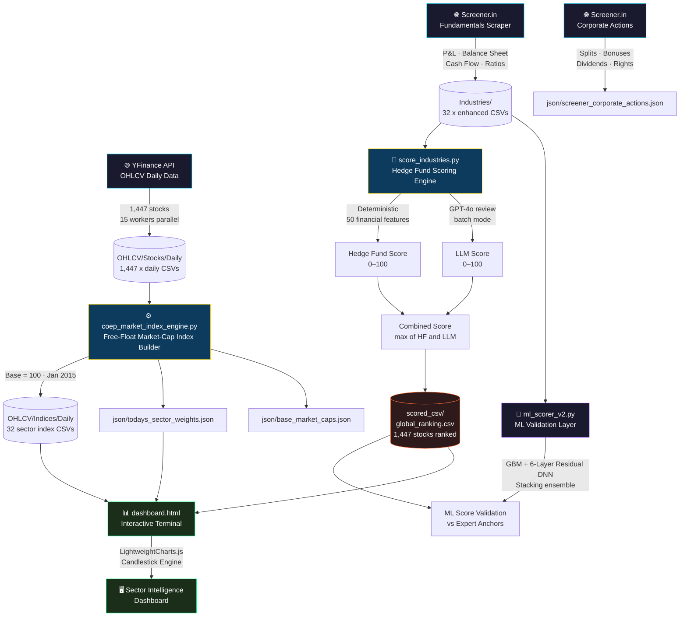

<div align="center">

<!-- ANIMATED SVG BANNER -->
<svg xmlns="http://www.w3.org/2000/svg" viewBox="0 0 900 200" width="100%">
  <defs>
    <linearGradient id="bg" x1="0%" y1="0%" x2="100%" y2="100%">
      <stop offset="0%" style="stop-color:#0a0a1a"/>
      <stop offset="50%" style="stop-color:#0d1b3e"/>
      <stop offset="100%" style="stop-color:#0a0a1a"/>
    </linearGradient>
    <linearGradient id="lineGrad" x1="0%" y1="0%" x2="100%" y2="0%">
      <stop offset="0%" style="stop-color:#00d4ff;stop-opacity:0"/>
      <stop offset="50%" style="stop-color:#00d4ff;stop-opacity:1"/>
      <stop offset="100%" style="stop-color:#7b2ff7;stop-opacity:0"/>
    </linearGradient>
    <filter id="glow">
      <feGaussianBlur stdDeviation="3" result="coloredBlur"/>
      <feMerge><feMergeNode in="coloredBlur"/><feMergeNode in="SourceGraphic"/></feMerge>
    </filter>
    <filter id="glow2">
      <feGaussianBlur stdDeviation="5" result="coloredBlur"/>
      <feMerge><feMergeNode in="coloredBlur"/><feMergeNode in="SourceGraphic"/></feMerge>
    </filter>
  </defs>
  <rect width="900" height="200" fill="url(#bg)" rx="12"/>
  <rect width="900" height="200" fill="none" rx="12" stroke="#00d4ff" stroke-width="1" stroke-opacity="0.3"/>
  <line x1="0" y1="50" x2="900" y2="50" stroke="#ffffff" stroke-opacity="0.03" stroke-width="1"/>
  <line x1="0" y1="100" x2="900" y2="100" stroke="#ffffff" stroke-opacity="0.03" stroke-width="1"/>
  <line x1="0" y1="150" x2="900" y2="150" stroke="#ffffff" stroke-opacity="0.03" stroke-width="1"/>
  <!-- Candlesticks -->
  <rect x="590" y="95" width="12" height="35" fill="#ff4466" rx="1" opacity="0.9" filter="url(#glow)"/>
  <line x1="596" y1="85" x2="596" y2="135" stroke="#ff4466" stroke-width="1.5" opacity="0.7"/>
  <rect x="615" y="80" width="12" height="40" fill="#00ff88" rx="1" opacity="0.9" filter="url(#glow)"/>
  <line x1="621" y1="70" x2="621" y2="125" stroke="#00ff88" stroke-width="1.5" opacity="0.7"/>
  <rect x="640" y="90" width="12" height="30" fill="#ff4466" rx="1" opacity="0.9" filter="url(#glow)"/>
  <line x1="646" y1="78" x2="646" y2="125" stroke="#ff4466" stroke-width="1.5" opacity="0.7"/>
  <rect x="665" y="65" width="12" height="50" fill="#00ff88" rx="1" opacity="0.9" filter="url(#glow)"/>
  <line x1="671" y1="52" x2="671" y2="120" stroke="#00ff88" stroke-width="1.5" opacity="0.7"/>
  <rect x="690" y="55" width="12" height="55" fill="#00ff88" rx="1" opacity="0.9" filter="url(#glow)"/>
  <line x1="696" y1="42" x2="696" y2="115" stroke="#00ff88" stroke-width="1.5" opacity="0.7"/>
  <rect x="715" y="68" width="12" height="40" fill="#ff4466" rx="1" opacity="0.9" filter="url(#glow)"/>
  <line x1="721" y1="55" x2="721" y2="115" stroke="#ff4466" stroke-width="1.5" opacity="0.7"/>
  <rect x="740" y="48" width="12" height="60" fill="#00ff88" rx="1" opacity="0.9" filter="url(#glow)"/>
  <line x1="746" y1="35" x2="746" y2="115" stroke="#00ff88" stroke-width="1.5" opacity="0.7"/>
  <rect x="765" y="38" width="12" height="65" fill="#00ff88" rx="1" opacity="0.9" filter="url(#glow)"/>
  <line x1="771" y1="25" x2="771" y2="110" stroke="#00ff88" stroke-width="1.5" opacity="0.7"/>
  <rect x="790" y="50" width="12" height="50" fill="#ff4466" rx="1" opacity="0.9" filter="url(#glow)"/>
  <line x1="796" y1="38" x2="796" y2="108" stroke="#ff4466" stroke-width="1.5" opacity="0.7"/>
  <rect x="815" y="32" width="12" height="70" fill="#00ff88" rx="1" opacity="0.9" filter="url(#glow)"/>
  <line x1="821" y1="20" x2="821" y2="108" stroke="#00ff88" stroke-width="1.5" opacity="0.7"/>
  <!-- Moving average -->
  <polyline points="590,110 615,100 640,100 665,85 690,75 715,82 740,68 765,60 790,68 821,55"
    fill="none" stroke="#ffd700" stroke-width="2" stroke-opacity="0.8" filter="url(#glow)" stroke-dasharray="4,2"/>
  <line x1="80" y1="160" x2="820" y2="160" stroke="url(#lineGrad)" stroke-width="1" opacity="0.6"/>
  <text x="50" y="58" font-family="monospace" font-size="11" fill="#00d4ff" opacity="0.7" letter-spacing="4">COEP QUANT FINANCE CLUB</text>
  <text x="48" y="100" font-family="monospace" font-weight="bold" font-size="32" fill="#ffffff" filter="url(#glow2)" letter-spacing="2">MARKET INDEX ENGINE</text>
  <text x="50" y="128" font-family="monospace" font-size="13" fill="#7b8ab8" letter-spacing="1">Institutional-Grade Sector Intelligence · 1,447 Stocks · 32 Sectors</text>
  <text x="50" y="180" font-family="monospace" font-size="10" fill="#00ff88" opacity="0.9">▲ ELECTRONICS +4245%</text>
  <text x="220" y="180" font-family="monospace" font-size="10" fill="#00ff88" opacity="0.9">▲ DEFENCE +1875%</text>
  <text x="370" y="180" font-family="monospace" font-size="10" fill="#00ff88" opacity="0.9">▲ CHEMICALS +1636%</text>
  <text x="530" y="180" font-family="monospace" font-size="10" fill="#ffd700" opacity="0.9">◆ TOP SCORE 93.0 · DIXON</text>
  <text x="720" y="180" font-family="monospace" font-size="10" fill="#00d4ff" opacity="0.7">BASE = 100 · 2015</text>
  <circle cx="855" cy="35" r="5" fill="#00ff88" filter="url(#glow2)">
    <animate attributeName="r" values="4;7;4" dur="2s" repeatCount="indefinite"/>
    <animate attributeName="opacity" values="1;0.4;1" dur="2s" repeatCount="indefinite"/>
  </circle>
  <text x="865" y="39" font-family="monospace" font-size="9" fill="#00ff88">LIVE</text>
</svg>

<br/>

[](https://python.org)
[](https://github.com/ranaroussi/yfinance)
[](https://screener.in)
[](https://pandas.pydata.org)
[](https://scikit-learn.org)
[](https://github.com/COEP-Quant-Finance-Club/COEP_Market_index)

<br/>

> **A production-grade, zero-forward-bias Indian equity intelligence platform** — combining free-float sector indices, institutional hedge fund scoring, LLM-augmented fundamental analysis, and ML model validation across **1,447 stocks** in **32 master sectors**.

</div>

---

## 📊 Live Sector Leaderboard

> All indices base-100 from **Jan 2015**. Rebuilt daily via YFinance.

```
╔══════════════════════════════════╦══════════╦═══════════════╦══════════╗
║  SECTOR                          ║  INDEX   ║  TOTAL RETURN ║  STOCKS  ║
╠══════════════════════════════════╬══════════╬═══════════════╬══════════╣
║  🏆 Electronics & EMS            ║  4,345.5 ║   +4,245.5%   ║    17    ║
║  🏦 Financial Infrastructure     ║  2,500.1 ║   +2,400.1%   ║    11    ║
║  ⚡ Power & Utilities            ║  2,275.7 ║   +2,175.7%   ║    35    ║
║  🛡️ Defence                      ║  1,975.5 ║   +1,875.5%   ║     8    ║
║  🧪 Chemicals                    ║  1,736.1 ║   +1,636.1%   ║   106    ║
║  💎 Jewellery                    ║  1,712.6 ║   +1,612.6%   ║    18    ║
║  💰 Financial Services           ║  1,617.8 ║   +1,517.8%   ║   128    ║
║  🛍️ Retail                       ║  1,533.6 ║   +1,433.6%   ║    16    ║
║  ⛏️ Metals & Mining              ║  1,123.1 ║   +1,023.1%   ║    86    ║
║  🚗 Automobiles                  ║    876.3 ║     +776.3%   ║   114    ║
║  💻 Information Technology       ║    762.4 ║     +662.4%   ║    92    ║
║  🏗️ Infrastructure               ║    694.2 ║     +594.2%   ║    24    ║
╚══════════════════════════════════╩══════════╩═══════════════╩══════════╝
```

---

## 🏗️ Architecture



---

## 🎯 Hedge Fund Scoring System

A fully **deterministic, peer-relative** scoring engine — no black box. Every score is explainable.

### Scoring Formula

$$\text{Peer}_{i,\text{pillar}} = 50 + \left(\text{rank\_pct}_i - 0.5\right) \times 100 \times \min\!\left(1,\ \frac{N}{15}\right)$$

$$\text{RawScore}_i = \sum_k w_k \cdot \text{Peer}_{i,k}$$

$$\text{HFScore}_i = \text{clip}\!\left(50 + \left(50 + (\text{RawScore}_i - 50)\cdot\sqrt{\text{Confidence}_i} - 50\right) \times 1.75,\ 0,\ 100\right)$$

$$\text{where}\ \ \text{Confidence}_i = \sqrt{\dfrac{\text{Available Features}_i}{N_\text{features}} \times \min\!\left(1,\ \dfrac{\text{History Years}_i}{5}\right)}$$

### Weight Profiles by Sector Type

| Pillar | 🏭 Standard | 🏦 Financial | ⚙️ Asset-Heavy |
|:---|:---:|:---:|:---:|
| 📈 Growth | 18% | 17% | 17% |
| 💹 Profitability | 22% | **27%** | 19% |
| 🏛️ Balance Sheet | 15% | **4%** | 9% |
| 💸 Cash Generation | 13% | 7% | **19%** |
| 💰 Valuation | 12% | **22%** | 14% |
| 👥 Ownership | 8% | 10% | 10% |
| ✅ Quality Flags | 12% | 13% | 12% |

> 🏦 **Financial Profile** (Banks, NBFCs): Uses ROE + ROA instead of OPM; skips debt/leverage/Altman red flags — borrowing is the business model.
>
> ⚙️ **Asset-Heavy Profile** (Infra, Power, Metals, Real Estate): D/E threshold relaxed to 3.0×; Altman Z-score disabled; interest coverage threshold lowered to 0.6× for greenfield commissioning phase.

### 🚩 Red Flag System

```
FLAG                                        CAP    FINANCIAL   ASSET-HEAVY
─────────────────────────────────────────────────────────────────────────
Negative Net Worth                          15     applied      applied
Losses in >60% reported periods             30     applied      applied
Promoters dumping (>3% quarter drop)        35     applied      applied
Chronic negative operating cash flow        20     SKIPPED      0.15 threshold
Altman Z-Score distress zone               20     SKIPPED      SKIPPED
Debt trap (D/E > 1.5x AND FCF < 0)        25     SKIPPED      D/E > 3.0x
Cannot cover interest from EBIT            25     SKIPPED      0.6x threshold
Heavy dilution with weak ROCE              35     applied      applied
Double working capital drain               30     applied      applied
```

### 🏅 Top 10 Global Rankings

| Rank | Stock | Symbol | Sector | HF Score | LLM Score | **Combined** |
|:---:|:---|:---:|:---|:---:|:---:|:---:|
| 🥇 | Dixon Technologies | `DIXON` | Electronics EMS | 90.5 | 93.0 | **93.0** |
| 🥈 | 3M India | `3MINDIA` | Diversified | 76.3 | 88.0 | **88.0** |
| 🥉 | Multi Commodity Exchange | `MCX` | Financial Infra | 80.6 | 88.0 | **88.0** |
| 4 | Great Eastern Shipping | `GESHIP` | Logistics | 76.5 | 88.0 | **88.0** |
| 5 | Hindustan Zinc | `HINDZINC` | Metals & Mining | 89.9 | 88.0 | **88.0** |
| 6 | Bharti Airtel | `BHARTIARTL` | Telecom | 89.0 | 88.0 | **88.0** |
| 7 | HBL Engineering | `HBLENGINE` | Automobiles | 86.3 | 86.0 | **86.0** |
| 8 | Sarda Energy | `SARDAEN` | Metals & Mining | 86.2 | 85.0 | **85.0** |
| 9 | GE Vernova T&D | `GVT&D` | Miscellaneous | 73.3 | 85.0 | **85.0** |
| 10 | GIPCL | `GIPCL` | Power & Utilities | 80.6 | 85.0 | **85.0** |

---

## 🤖 ML Validation Layer

A stacking ensemble validates scores against quantitative expert anchors:

```
┌─────────────────────────────────────────────────────────────────┐
│                      ML SCORING PIPELINE                         │
├──────────────────────┬────────────────────┬─────────────────────┤
│   FEATURE EXTRACTOR  │   BASE LEARNERS    │    META LEARNER     │
│                      │                    │                     │
│  50 per-stock ratios │  GBM               │                     │
│  • EPS, CAGR         │  GradientBoosting  │  Ridge Regression   │
│  • Growth metrics    │  Regressor         │  stacked ensemble   │
│  • Dynamic column    │                    │                     │
│    scanner for all   │  DNN: 6-Layer      │  Expert Validation  │
│    Screener CSVs     │  Residual Network  │  27 anchor stocks   │
│                      │  Huber loss        │  MAE ≈ 9.2          │
└──────────────────────┴────────────────────┴─────────────────────┘
```

---

## 🔬 Index Methodology

**Zero-forward-bias free-float market-cap weighted** sector indices:

```
Fixed Shares:     Qᵢ  = (BaseMarketCap₀ × 10⁷) / BasePrice₀

Daily Market Cap: Mᵢ,ₜ = Priceᵢ,ₜ × Qᵢ

Sector Weights:   wᵢ,ₜ₋₁ = Mᵢ,ₜ₋₁ / Σ Mⱼ,ₜ₋₁   (lagged — zero forward bias)

Sector Return:    Rₛ,ₜ  = Σ wᵢ,ₜ₋₁ × (Priceᵢ,ₜ - Priceᵢ,ₜ₋₁) / Priceᵢ,ₜ₋₁

Index Level:      Iₜ   = Iₜ₋₁ × (1 + Rₛ,ₜ)     [I₀ = 100, Jan 2015]
```

> Share counts are **fixed at base date** — index moves purely from price changes, not dilution events.

---

## 📁 Project Structure

```
Portfolio Management/
│
├── 🚀 coep_market_index_engine.py    Master pipeline (single entry point)
├── 🌐 screener_scraper.py            Screener.in fundamentals harvester
├── 🗂️  sector_organizer.py           Master sector classification (32 sectors)
├── 📈 unified_ohlcv_downloader.py    Historical OHLCV bootstrapper
│
├── 🖥️  dashboard.html                Interactive sector terminal (LightweightCharts)
│
├── json/                             Persistent manifests (git-tracked)
│   ├── base_market_caps.json         Fixed share counts for index calculation
│   ├── todays_sector_weights.json    Daily market-cap weights per sector
│   ├── fixes_applied.json            Split/bonus adjustment audit log
│   ├── screener_corporate_actions.json
│   └── update_summary.json
│
├── OHLCV/
│   ├── Stocks/Daily/                 1,447 × daily OHLCV CSVs
│   └── Indices/Daily/                32 × sector index CSVs (base=100)
│
└── Industries/
    ├── *_enhanced.csv                32 sector fundamental datasets
    └── hedge_fund_scoring/
        ├── score_industries.py       Scoring engine (deterministic + LLM)
        ├── ml_scorer_v2.py           ML validation pipeline
        ├── scoring_config.json       Sector profiles & weights
        └── scored_csv/
            ├── global_ranking.csv    1,447 stocks, globally ranked
            ├── top_bottom_20.csv     Best & worst 20 stocks
            └── *_scored.csv          Per-sector scored outputs
```

---

## ⚡ Quick Start

### 1. Clone & Install

```bash
git clone https://github.com/COEP-Quant-Finance-Club/COEP_Market_index.git
cd COEP_Market_index
pip install yfinance pandas numpy scikit-learn torch openai requests beautifulsoup4
```

### 2. Daily Update (Full Pipeline)

```bash
python coep_market_index_engine.py
# Downloads OHLCV, audits corporate actions, rebuilds 32 sector indices
```

### 3. Score All Sectors — No LLM

```bash
python Industries/hedge_fund_scoring/score_industries.py \
  --input-dir Industries \
  --output-dir Industries/hedge_fund_scoring/scored_csv \
  --no-llm
```

### 4. Score with LLM Review

```bash
# Add OPENAI_API_KEY to Industries/hedge_fund_scoring/.env
python Industries/hedge_fund_scoring/score_industries.py \
  --input-dir Industries \
  --output-dir Industries/hedge_fund_scoring/scored_csv \
  --llm --max-llm-stocks 50
```

### 5. Run ML Validation

```bash
python Industries/hedge_fund_scoring/ml_scorer_v2.py
# → ml_scores_v2.csv · expert_validation_v2.csv · model_comparison_v2.csv
```

### 6. Open Dashboard

```bash
# No server needed — just open in browser
start dashboard.html    # Windows
open dashboard.html     # macOS
```

---

## 📡 Data Sources

| Source | What | When |
|:---|:---|:---:|
| **YFinance** | OHLCV candles, official splits & dividends | Daily |
| **Screener.in** | P&L · Balance Sheet · Cash Flow · Key Ratios · Shareholding | Quarterly |
| **Screener Filings** | Bonus · Rights · Splits · Buyback · Dividend actions | On-demand |
| **OpenAI GPT-4o** | Qualitative score review and narrative rationale | On-demand |

---

## 🗺️ Sector Universe

**32 master sectors** — every NSE/BSE stock maps to exactly one:

| Profile | Sectors |
|:---|:---|
| 🏦 **Financial** | Banking · Financial Services · Financial Infrastructure |
| ⚙️ **Asset-Heavy** | Infrastructure · Power & Utilities · Real Estate · Telecom · Oil & Gas · Capital Goods · Renewable Energy · Metals & Mining · Building Materials · Airlines · Hospitality · Logistics · Healthcare Services |
| 🏭 **Standard** | Automobiles · Chemicals · IT · Consumer Staples · Consumer Durables · Defence · Electronics EMS · Retail · Textiles · Jewellery · Digital Platforms · Media & Entertainment · Agriculture · Diversified · Miscellaneous |

---

## 🤝 Contributing

```bash
# 1. Fork and create a feature branch
git checkout -b feature/add-new-stocks

# 2. Add stocks to Data.csv (Symbol, Stock Name, industry, market_cap)
# 3. Download OHLCV history
python unified_ohlcv_downloader.py

# 4. Scrape Screener fundamentals
python screener_scraper.py

# 5. Re-score with fixes
python Industries/hedge_fund_scoring/score_industries.py --no-llm

# 6. Open a PR with updated scored_csv/ outputs
```

---

<div align="center">

```
┌──────────────────────────────────────────────────────────────┐
│           COEP QUANT FINANCE CLUB  ·  EST. 2024              │
│   "Markets are a device for transferring money from the      │
│     impatient to the patient."  —  Warren Buffett            │
└──────────────────────────────────────────────────────────────┘
```

[](https://github.com/COEP-Quant-Finance-Club/COEP_Market_index)
[](https://github.com/COEP-Quant-Finance-Club/COEP_Market_index)

</div>
